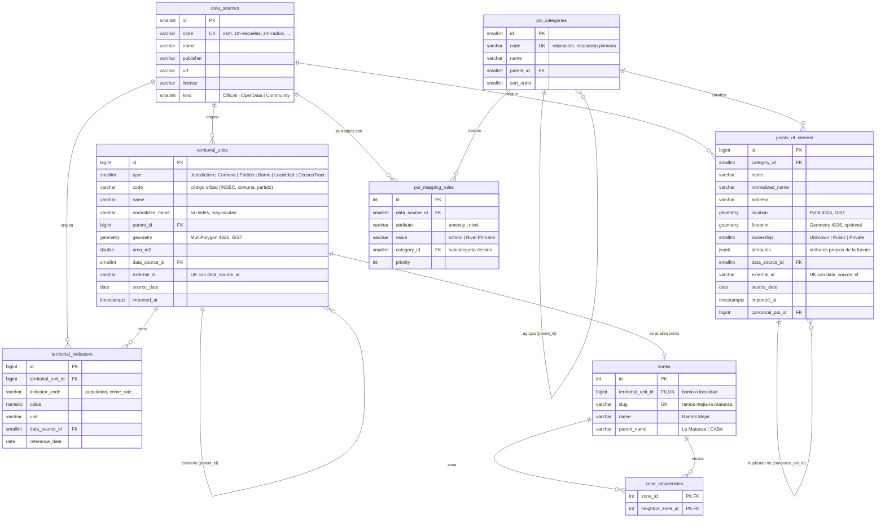

# Modelo de datos de zonas y unidades (PBI 3 · tarea 3.2)

Este modelo es el **contrato interno** de ZonaMatch. Las fuentes externas (base compartida
`zm.*`, OpenStreetMap, archivos oficiales) solo se leen durante la ingesta. Todo lo que
consume la API sale de estas tablas, que viven en el esquema `zonamatch`, siempre en
**EPSG:4326**.

## DER



## Decisiones de diseño

**Una tabla jerárquica para todas las unidades.** Barrio, localidad, comuna, partido y
radio comparten estructura (nombre, código, polígono, procedencia). Separarlas en cinco
tablas duplicaría índices y consultas. El tipo y el `parent_id` arman la jerarquía:

```text
Jurisdicción (CABA)          Jurisdicción (Buenos Aires)
└── Comuna                   └── Partido
    ├── Barrio                   ├── Localidad
    └── Radio censal             └── Radio censal
```

El radio censal cuelga de la comuna o el partido, que es lo que informa el INDEC. El barrio
o la localidad que lo contiene se resuelve espacialmente cuando hace falta (PBI 14).

**`zones` separada de `territorial_units`.** No toda unidad se analiza: solo barrios de
CABA y localidades de los 24 partidos. `zones` fija esa lista, guarda el nombre para
mostrar y un `slug` estable para URLs, análisis guardados y favoritos. Si mañana se analiza
por radio o por un polígono propio, cambia esta tabla y no el resto.

**Adyacencia materializada.** `zone_adjacencies` se calcula al construir las zonas
(`ST_Intersects` sobre el borde). Así la pantalla H05 lista aledañas sin cálculo espacial
en cada pedido (PBI 53a).

**Taxonomía propia de POIs.** `poi_categories` tiene dos niveles: las 7 categorías estándar
de las pantallas (Transporte, Educación, Salud, Comercios y servicios, Deporte, Espacios
verdes, Cultura y gastronomía) y sus subcategorías. Los POIs siempre apuntan a una
subcategoría. Cada fuente se traduce con `poi_mapping_rules`; agregar, por ejemplo,
veterinarias (PBI 69) es insertar una subcategoría y una regla `amenity = veterinary`.

**Punto representativo y huella.** `location` es siempre un punto (para radios de
búsqueda y marcadores). Si la fuente trae un polígono, se guarda en `footprint` y
`location` es un punto interior de ese polígono.

**Duplicados entre fuentes.** `canonical_poi_id` apunta al POI que se muestra. La
deduplicación compara subcategorías de la misma categoría, distancia (≤ 100 m) y nombre
normalizado. Gana la fuente oficial.

**Indicadores con trazabilidad.** `territorial_indicators` asocia valores a cualquier
unidad (zona, partido, radio). Si la zona no tiene un indicador, el servicio sube por
`parent_id` y marca el valor como **heredado** (PBI 21, 37a).

## Índices

| Tabla | Índice | Uso |
|---|---|---|
| `territorial_units` | GiST(`geometry`) | Punto en polígono, adyacencia |
| `territorial_units` | (`type`, `normalized_name`) | Búsqueda por nombre |
| `territorial_units` | (`type`, `code`) único parcial | Resolver padres por código oficial |
| `territorial_units` | (`data_source_id`, `external_id`) único | Reimportación idempotente (upsert) |
| `points_of_interest` | GiST(`location`) | POIs en un radio (`ST_DWithin` sobre `geography`) |
| `points_of_interest` | (`category_id`) | Filtro por capa |
| `points_of_interest` | (`data_source_id`, `external_id`) único | Reimportación idempotente |
| `territorial_indicators` | (`territorial_unit_id`, `indicator_code`) | Lectura y herencia |

El DDL se genera desde las migraciones de EF Core: [`db/ddl/zonamatch_schema.sql`](../db/ddl/zonamatch_schema.sql).
